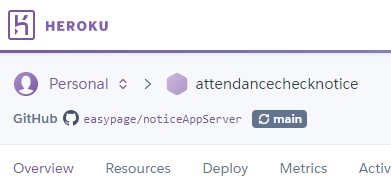
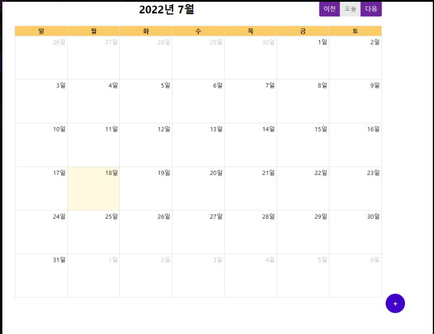
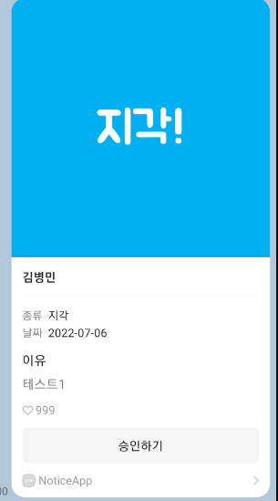
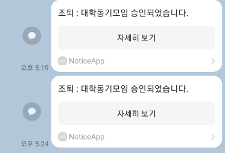
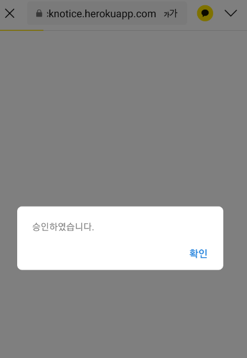
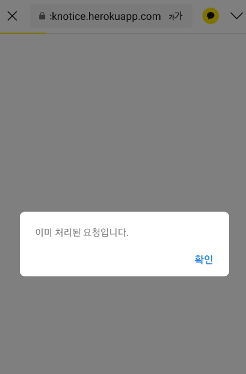

# Study_Node_KakaoAPI

> 이 프로젝트는 nodeJS를 통하여 백엔드를 구축 및 배포를 익히기 위한 **스터디 프로젝트**입니다..

## D**istribution site**

<aside>
💡 제작기간 : 2022/07/01 - 2022/07/15

</aside>

<aside>
💡 **Server**는 **Heroku**를 이용하여 **nodejs**를 배포하였습니다.

</aside>

<aside>
⏩ [heroku배포서버](https://attendancechecknotice.herokuapp.com/)

</aside>

---

## 사용기술

- **NodeJS**
- **Express(서버)**
- **Heroku(배포)**
- **KakaoAPI**
- **MongoDB**
- **React**

---

### 기능

### CRUD

<aside>
💡 **기능 - FullCalendar**의 기능을 이용하여 ****간단하게 일정관련 데이터에 관한 crud처리가 가능하도록 만들었습니다.

</aside>

<aside>
💡 **기능** - 일정이 **등록, 수정**되거나 **승인**이 되면 카카오톡 메세지로 **알림**이 오도록 제작하였습니다.

</aside>

<aside>
💡 기능 - 일정이 **업데이트**되거나 **등록**이 되면 **승인**이 가능한 **메세지가 발송**되며 **승인 버**튼을 누르면 **DB가 업데이트** 되고 **승인 되었다는 메세지**가 전송됩니다.

</aside>

### Front(이승제)

<aside>
💡 **Front-**

</aside>

## 후기

### BackEnd(김병민)

- Node로 처음으로 백엔드에 대한 프로젝트를 진행 하였는데 기존의 프론트로 웹을 만들던 지식이 있어서 그런지 전체적인 흐름을 읽기는 수월했었습니다.**(NodeJS,Express)**
- 백엔드를 구성하는 과정에서 생각보다 꽤나 까다로운 오류들이 많이 발생 하였는데 생각보다 백엔드는 까다로운 **설정 및 구성**이 많다고 느꼈습니다.**(BackEnd)**
- 로직을 짠다든지 에러핸들링을 어떻게 할것인지, 보안을 어떻게 할것인지 등을 공부해야 할것이 많다고 느꼈습니다.**(BackEnd)**
- Kakao API의 메세지 템플릿은 json의 형태를 **‘template=’**라는 단어를 붙여야 만들어 준다는것을 알았습니다,**(KakaoAPI)**
- **관리자 페이지**를 만들어서 **관리자의 토큰**을 받아
  그 토큰의 관리자에게 카카오톡 메세지를 가도록 하는 기능을 완성시키지 못한것이 아쉬웠습니다.**(Project)**
- **NoSql**인 몽고디비를 활용하니 SQL공포증이 있던 저는 꽤나 편한 경험을 하였습니다!(**MongoDB**)

### FrontEnd
