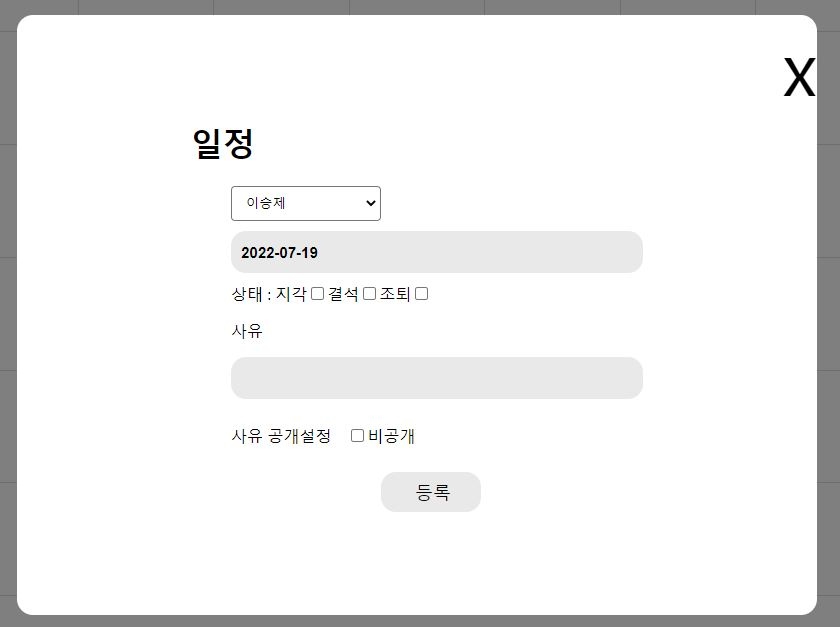
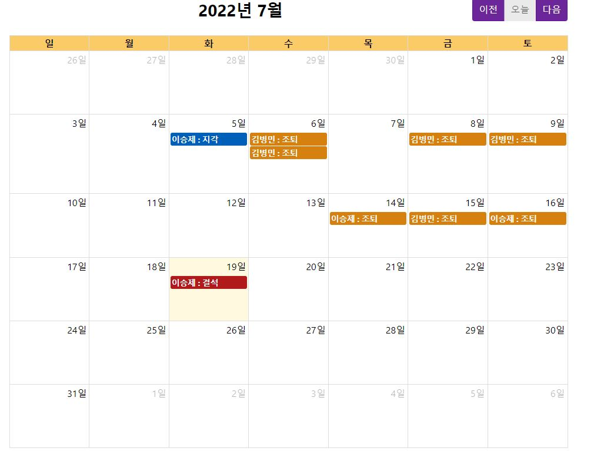
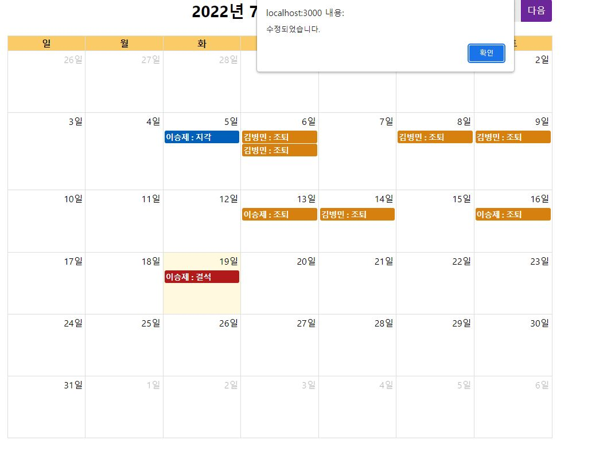

# Study_Node_KakaoAPI

> 이 프로젝트는 nodeJS를 통하여 백엔드를 구축 및 배포를 익히기 위한 **스터디 프로젝트**입니다.

## **Distribution site**

💡 제작기간 : 2022/07/01 - 2022/07/15  
 
⏩ 제작자 : Front: 이승제 Back: 김병민 

💡 **Server** 는 **Heroku**를 이용하여 **nodejs**를 배포하였습니다.

⏩ [프론트엔드 Github](https://github.com/easypage/NoticeApp)
⏩ [heroku배포서버](https://attendancechecknotice.herokuapp.com/) 

---

## 사용기술

- **React**
- **NodeJS**
- **Express(서버)**
- **Heroku(배포)**
- **KakaoAPI**
- **MongoDB**
   

---

## 💡 FrontEnd(이승제) 

 
캘린더 화면의 +버튼을 클릭하여 이름, 날짜, 출결상태, 사유, 사유 공개설정의 데이터를 넣어주기 위한 모달을 만들었습니다.

 
모달로 입력받은 데이터를 DB에저장하고, DB에 입력한 데이터를 캘린더 화면에 출력시켜주었습니다.

 
FullCalendar기능인 eventDrop을 이용하여 원하는 날짜에 놓으면 '수정되었습니다.'라는 메시지 창을 띄어줌과 동시에 바뀐 데이터가 DB에 저장됩니다.

## 💡 BackEnd(김병민) 

### **CRUD** 

 

💡 **기능 - FullCalendar**의 기능을 이용하여 **간단하게** 일정관련 데이터에 관한 crud처리(**MongoDB**) 가능하도록 만들었습니다. 

 

 

### **알림** 

💡 **기능** - 일정이 **등록, 수정**되거나 **승인**이 되면 카카오톡 메세지로 **알림**이 오도록 제작하였습니다. 

 

 

### **승인하기** 

💡 **기능** - 일정이 **업데이트**되거나 **등록**이 되면 **승인**이 가능한 **메세지가 발송**됩니다. 
메세지의 **승인** 버튼을 누르면 **DB가 업데이트** 되고 **승인 되었다는 메세지**가 전송됩니다. 

# **후기** 

 

### ⏩ FrontEnd(이승제)

- 리액트 기초지식없이 프로젝트를 진행하여 '조금만 더 공부하고 시작했으면 좋았을껄'이라는 아쉬움이 있었습니다.
- PHP의 Ajax기능과 비슷한 기능이 axios인줄 알았는데 형태가 달라서 쓰는데 어려움이 있었습니다.
- HTML,PHP,CSS,JS를 이용해 웹을 만들던 경험이 있어 기초지식이 없던 리액트를 사용하는데 큰 어려움은 없었습니다.
- 계획했던대로 프로젝트결과가 나오지 않아 아쉬움이 크게 느껴졌고, '다음에는 잘 할 수 있겠다'라는 생각이들었습니다.

### ⏩ BackEnd(김병민) 

- Node로 처음으로 백엔드에 대한 프로젝트를 진행 하였는데 기존의 프론트로 웹을 만들던 지식이 있어서 그런지 전체적인 흐름을 읽기는 수월했었습니다.**(NodeJS,Express)** 
- 백엔드를 구성하는 과정에서 생각보다 꽤나 까다로운 오류들이 많이 발생 하였는데 생각보다 백엔드는 까다로운 **설정 및 구성**이 많다고 느꼈습니다.**(BackEnd)** 
- 로직을 짠다든지 에러핸들링을 어떻게 할것인지, 보안을 어떻게 할것인지 등을 공부해야 할것이 많다고 느꼈습니다.**(BackEnd)** 
- Kakao API의 메세지 템플릿은 json의 형태를 **‘template=’**라는 단어를 붙여야 만들어 준다는것을 알았습니다,**(KakaoAPI)** 
- **관리자 페이지**를 만들어서 **관리자의 토큰**을 받아
  그 토큰의 관리자에게 카카오톡 메세지를 가도록 하는 기능을 완성시키지 못한것이 아쉬웠습니다.**(Project)** 
- **NoSql**인 몽고디비를 활용하니 SQL공포증이 있던 저는 꽤나 편한 경험을 하였습니다!(**MongoDB**) 
